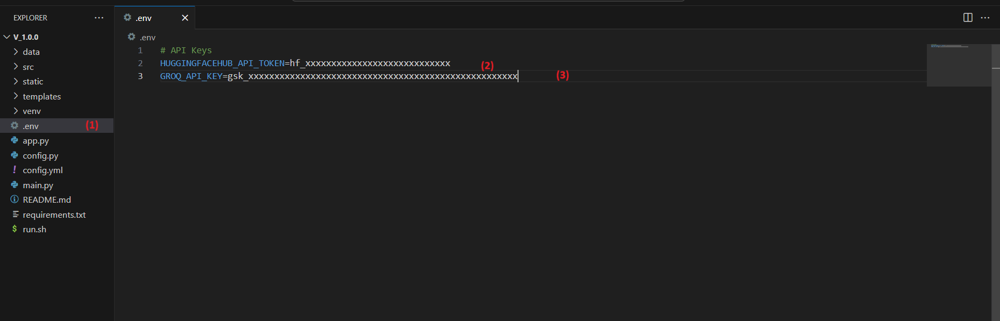

# 📚 LuminaQA - Smart Document QA (RAG on Holy Books)

This project is a **Retrieval-Augmented Generation (RAG)** pipeline built using **LlamaIndex** and **LangChain**, designed to intelligently answer user questions based on documents such as holy books.

It includes both a **console-based interface** and a **web UI** built with **Flask**, letting users query sacred texts and retrieve:

- 🧠 **General LLM Answer** (via Groq’s `llama3-8b-8192`)
- 📘 **Source-Based Answer Only** (strictly from the documents)
- 📄 **Document Source Info** (filename and page number)
- 📊 **Search Metrics** (including relevance score and performance)

---

## 🧠 How It Works

- **Embedding & Indexing**: Handled by `LlamaIndex` using Hugging Face's `sentence-transformers/all-MiniLM-L6-v2`
- **Language Model**: Queried using Groq’s ultra-fast LLMs
- **Storage**: Keeps track of indexed document hashes for smart re-indexing
- **Persistence**: Maintains conversation history across runs for context awareness

---

## ✨ Features

- 🔍 Ask questions about your document collection
- 💬 Context-aware LLM response using chat history
- 📄 Precise source-based summaries using retrieved chunks only
- 📊 Automatic metrics reporting
- 🖥️ Console interface (`main.py`)
- 🌐 Flask-based Web UI (`main.py --web`)

---

## 🚀 Getting Started

### 1. Clone the repository

```bash
git clone https://github.com/DaivikM/LuminaQA.git
cd LuminaQA
```

### 2. Create a Conda environment

```bash
conda create -p venv python==3.12.9
conda activate venv/
```

### 3. Install dependencies

```bash
pip install -r requirements.txt
```

### 4. Add your API keys

Create and Set your API keys inside .env file:
```python
HUGGINGFACEHUB_API_TOKEN = "your_token_here"
GROQ_API_KEY = "your_token_here"
```


In the screenshot above, you'll see where to create the .env file and where to add your API keys of Huggingface and Groq

---

## 🧪 Running the App

### Console mode:
```bash
python main.py
```

### Web UI mode:
```bash
python main.py --web
```

---

## 💡 Notes

- Indexing only re-runs for new/changed documents (based on MD5 hash)
- Conversation context is preserved across sessions
- Summarization is applied to older history to save tokens

---

## 🧘 Built For
- Exploring spiritual or religious texts
- Context-rich Q&A with document grounding
- RAG experimentation with cutting-edge LLMs

---

## 📜 License

This project is licensed under the **MIT License**.

You can freely use, modify, and distribute the software with attribution, and without any warranty. See the [LICENSE](LICENSE) file for more details.

---

## 📞 Contact

For questions or support, feel free to reach out:
- Email: [dmohandm11@gmail.com](mailto:dmohandm11@gmail.com)
- GitHub: [DaivikM](https://github.com/DaivikM)

---

## 📚 References

- [Hugging Face](https://huggingface.co/)
- [GROQ](https://console.groq.com/docs/api-reference#chat-create)

---

### 🚀 Happy Coding! ✨

Clone this repository and experience real-time STT powered by Hugging Face and Vosk, utilizing the browser microphone through a WebSocket connection.


**Made with 💛 using LlamaIndex + LangChain + Groq + HuggingFace + Flask**

